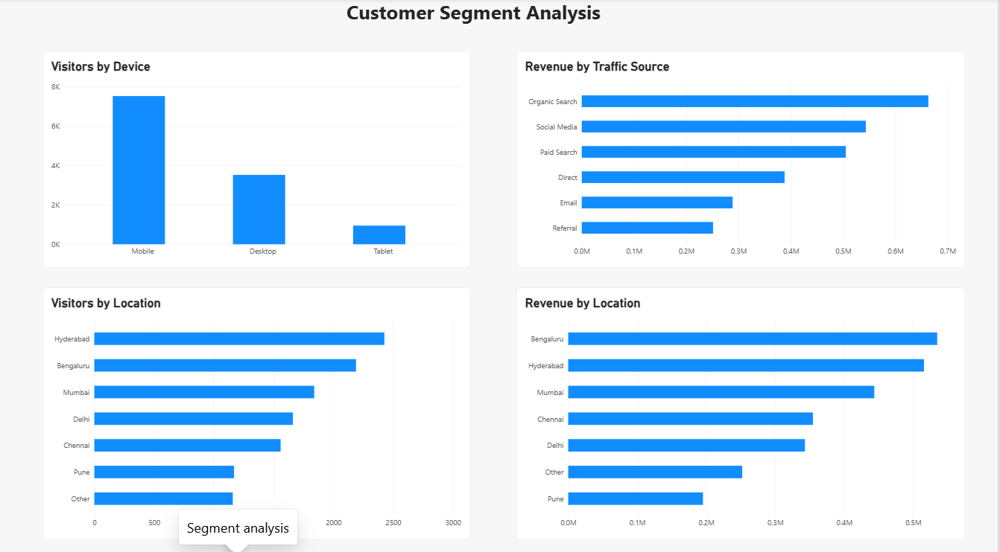
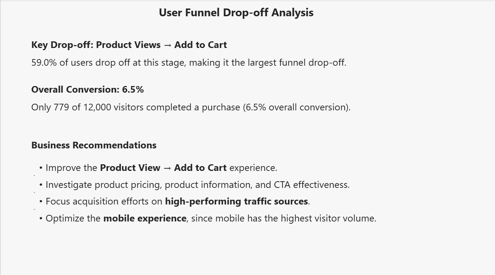

# E-commerce User Funnel & Conversion Analysis

## Project Overview

This project analyzes e-commerce user behavior from the initial visit through completed purchase. The analysis focuses on understanding the customer funnel, identifying major drop-off points, and evaluating performance across traffic sources, devices, locations, and time.

The goal is to identify where users are most likely to drop off and provide actionable business insights to improve overall conversion performance.

---

## Business Problem

An e-commerce business receives users from multiple traffic sources and devices, but not all users progress through the purchasing journey.

This analysis aims to answer the following business questions:

- Where do users drop off in the purchasing funnel?
- Which funnel stage has the highest drop-off?
- Which traffic sources generate the strongest conversion performance?
- How do different devices perform?
- Which locations contribute the most users?
- How does user activity and conversion vary over time?
- Which areas provide opportunities for improving conversion and revenue?

---

## Dataset

The dataset contains **12,000 e-commerce user sessions** covering the period from **January 1, 2026 to March 31, 2026**.

### Key Fields

- Session Date
- Device
- Traffic Source
- Location
- Visited
- Signed Up
- Viewed Product
- Added to Cart
- Started Checkout
- Purchased
- Order Value
- Session Duration

The funnel stages analyzed are:

**Visit → Sign Up → Product View → Add to Cart → Checkout → Purchase**

---

## Tools Used

- **MySQL** — Data validation, SQL analysis, funnel calculations, segmentation, and revenue analysis
- **Power BI** — Interactive dashboard development and data visualization
- **Excel / CSV** — Dataset preparation and storage
- **GitHub** — Project documentation and portfolio presentation

---

## Dashboard

The Power BI dashboard contains three analytical pages.

### 1. Executive Overview

The Executive Overview provides a high-level summary of the e-commerce funnel and overall business performance.

It includes:

- Total visitors
- Total purchases
- Overall conversion rate
- Funnel performance
- Traffic source performance
- Device performance
- Location performance
- Daily visitor and conversion trends


---

### 2. Customer Segment Analysis

This page evaluates customer performance across different segments.

The analysis includes:

- Traffic source comparison
- Device performance
- Geographic performance
- Purchase conversion by segment
- Order value comparison
- Identification of stronger and weaker performing segments



---

### 3. Drop-off Analysis

This page focuses on the customer funnel and identifies where users leave the purchasing journey.

The analysis examines:

- Funnel-stage performance
- Conversion between stages
- Drop-off between consecutive stages
- Major conversion bottlenecks
- Opportunities for improving the customer journey



---

## Key Findings

### Funnel Performance

- The dataset contains **12,000 visitors**.
- **5,429 users** signed up.
- **4,259 users** viewed a product.
- **1,747 users** added a product to their cart.
- **1,115 users** started checkout.
- **779 users** completed a purchase.
- Overall conversion from visitors to purchases is approximately **6.5%**.

### Major Drop-off

The largest drop-off occurs between:

**Product Views → Add to Cart**

Approximately **59.0% of users** drop off at this stage.

This represents the most important opportunity for improving the overall conversion funnel.

### Traffic Source Performance

- **Organic Search** generates the highest visitor volume.
- Organic Search also produces the highest total order value.
- **Social Media** has the highest purchase conversion rate at approximately **7.43%**.
- **Direct** has the lowest purchase conversion rate at approximately **5.96%**.

### Device Performance

- **Mobile** generates the highest total order value.
- Mobile also accounts for the largest share of visitors.
- **Desktop** has a higher purchase conversion rate than Mobile.
- This indicates that improving the mobile purchasing experience could have a significant commercial impact.

### Geographic Performance

- **Hyderabad** has the highest visitor volume with **2,426 visitors**.
- Bengaluru follows with **2,189 visitors**.
- Mumbai, Delhi, Chennai, Pune, and Other locations contribute the remaining traffic.

### Daily Performance

Daily visitor activity remains relatively consistent throughout the analyzed period, with approximately **105–157 visitors per day**.

No sustained upward or downward traffic trend was identified during the analysis period.

---

## Business Recommendations

### 1. Improve Product View → Add to Cart Conversion

The largest funnel loss occurs after users view products but before they add items to their cart.

Potential areas to investigate include:

- Product page design
- Product information
- Pricing visibility
- Product images
- Calls-to-action
- Customer reviews
- Offers and promotions
- Add-to-cart usability

### 2. Continue Investing in Organic Search

Organic Search generates strong traffic volume and the highest total order value.

The business should continue monitoring and optimizing its organic search strategy.

### 3. Study Successful Social Media Traffic

Social Media produces the highest purchase conversion rate.

The business should analyze the campaigns, audiences, content, and landing pages contributing to this performance and identify opportunities to scale successful approaches.

### 4. Prioritize Mobile User Experience

Mobile contributes the highest total order value and represents the largest user segment.

Improving mobile navigation, product pages, cart functionality, and checkout experience could have a meaningful impact on overall business performance.

### 5. Investigate Hyderabad Traffic

Hyderabad generates the highest visitor volume.

Further analysis could determine whether this traffic represents strong purchasing potential and whether location-specific marketing or customer experience improvements could increase conversions.

### 6. Continue Monitoring Daily Performance

Daily traffic and conversion should continue to be monitored so that meaningful changes in user behavior can be identified early.

---

## Project Structure

```text
data/
└── user_funnel_raw_data.csv

sql/
└── Project_1_User_Funnel_Analysis.sql

powerbi/
└── Ecommerce_User_Funnel_Analysis.pbix

screenshot/
├── Executive overview.png
├── Segment-analysis.png
└── Dropoff-analysis.png

README.md
